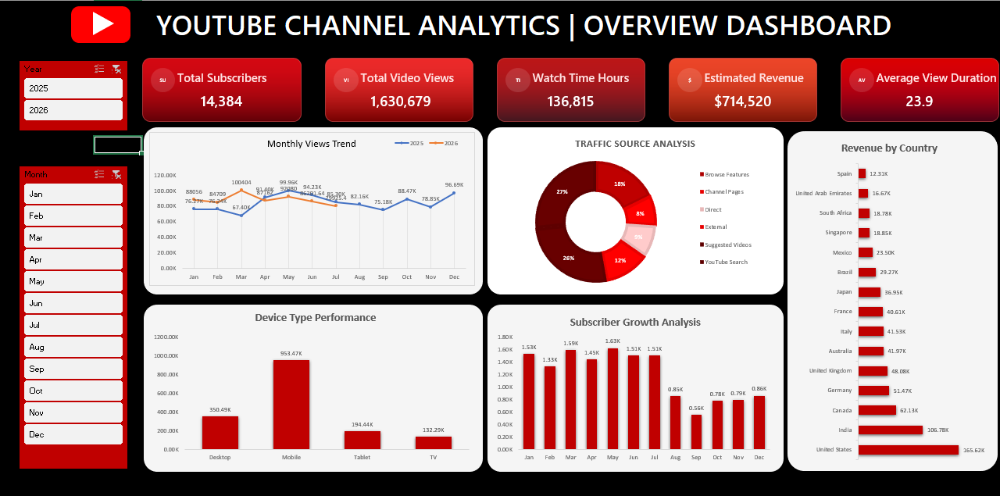

#  [ ▶︎ ] Youtube Channel Analytics

Analyze Youtube Channel Dataset and transform it into actionable business insight that monitors channel performance, audience engagement, and revenue, enabling data-driven decisions for sustainable channel growth.

## 📌 Table of Contents

- <a href="#overview">Overview</a>
- <a href="#problem-statement">Problem Statement</a>
- <a href="#dataset">Dataset</a>
- <a href="#tools--technologies">Tools & Technology</a>
- <a href="#data-cleaning--preparation">Data Cleaning & Preparation</a>
- <a href="#exploratory-data-analysis-eda">Exploratory Data Analysis (EDA)</a>
- <a href="#research-question--key--findings">Research & Key Finding</a>
- <a href="#dashboard">Dashboard</a>
- <a href="#result-&-conclusion">Results & Conclusion</a>
- <a href="#future-work">Future Work</a>

---

<h2>📘 Overview</h2>

The YouTube Channel Analytics dataset is an Excel-based business intelligence solution designed to analyze the performance and growth of a YouTube channel. It organizes 577 daily records (January 2025–July 2026) into a structured format using data cleaning, pivot tables, and an interactive dashboard for effective analysis.

---

<h2>🎯 Problem Statement</h2>

<b>The primary objective of this workbook is to transform raw daily YouTube analytics into an interactive reporting system that helps answer important business questions, such as:</b>

- Which months generate the highest views and revenue?
- Which countries contribute the largest audience?
- Which countries contribute the largest audience?
- Which devices are most commonly used to watch videos?
- Which demographic segments (age and gender) engage the most?
- How effectively do views convert into subscribers and revenue?
- Is the channel consistently growing over time?

---

<h2>🗂️ Dataset</h2>

CSV file located in `/Data/` folder (RawData)

---

<h2>🛠️ Tools & Technology</h2>

### Tools
1. **Excel**: Functions, Pivot Charts, Interactive Dashboards
2. **SQL**: Common Table Expression, Joins, Filtering, Having, Correlated subquery, Running time, LAG() & LEAD()
3. **Git**: Project Upload

---

<h2>🧹 Data Cleaning & Preparation</h2>
  
<b>Data Quality</b>

- Update column formatting
- Update data type

---

<h2>🔍 Exploratory Data Analysis (EDA)</h2>

<b>Negative or Zero Value Detected</b>

- Subscriber_Gained = 0 (9 specific days zero Subscriber gain)
- 34 (-97 loss making subscriber)

<b>Correlation Analysis:</b>

- Strong between `views`<->`Watch Time Hour` r = (0.8)
- Strong between `Revenue`<->`Views` r = (0.7)
  
---

<h2>💡 Research & Key Finding</h2>

<b>Research Question</b>

- How has the channel performed over the analysis period?
- Which traffic source generates the most revenue?
- Which age group watches the most?
- Which device drives the most watch time?
- Are subscriber gains aligned with increasing views and watch time?

<b>Key Findings</b>

* Performance follows a recurring seasonal cycle, so content pushes and campaigns land better in the first half of the year
* Source quality
* 25-44 is the channel's core viewing demographic.
* Per-session engagement and overall reach favor different devices, so device strategy should account for both
* Absolutely, No

---

<h2>📊 Dashboard</h2>

<b>Excel dashboard visualize:</b>

* Growth
* Reach
* Engagement
* Monetization
* Retention

---

<h2>✅ Results & Conclusion</h2>

The YouTube Analytics Workbook successfully transforms raw analytical data into an interactive business intelligence solution capable of tracking both operational and strategic KPIs.

- Daily performance can be monitored efficiently using automated dashboard visuals.
- Views, Watch Time, Revenue, and Subscribers provide a comprehensive picture of channel growth.
- Demographic and geographic segmentation enables better understanding of the target audience.
- Device and traffic source analysis reveal opportunities to improve content distribution and accessibility.
- Historical performance trends support data-driven planning rather than relying on assumptions.

The **YouTube Channel Analytics Workbook** effectively integrates engagement, audience, and monetization metrics into an interactive dashboard, enabling data-driven decisions that support sustainable channel growth, improved audience retention, and higher revenue.

---

<h2>🚀 Future Work</h2>

<b>To further enhance the analytical capabilities of this workbook, the following improvements can be implemented:</b>

* Predictive Performance Forecasting
* Advanced Audience Segmentation
* Content Performance Analytics
* Revenue & Monetization Optimization
* Real-Time Business Intelligence Dashboard

---
